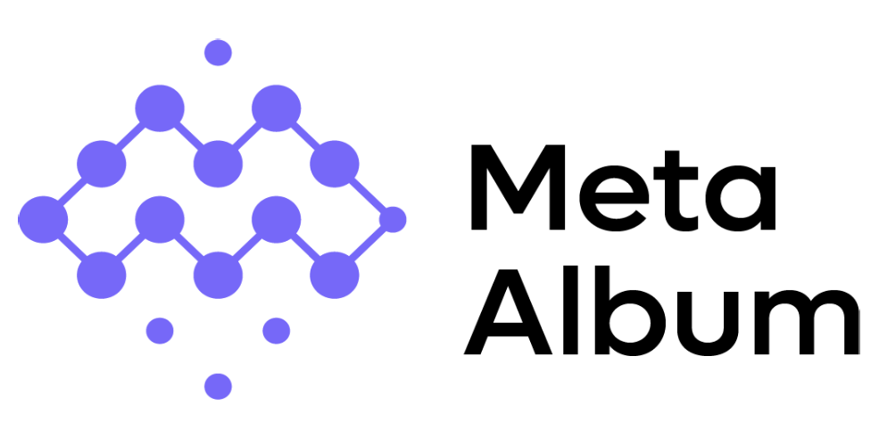

## [https://meta-album.github.io/](https://meta-album.github.io/)

This is the official repository for **Meta-Album**, an image classification meta-dataset designed to facilitate few-shot learning, transfer learning, meta-learning, among other tasks. It includes 40 open datasets, each having at least 20 classes with 40 examples per class, with verified licences. They stem from diverse domains, such as ecology (fauna and flora), manufacturing (textures, vehicles), human actions, and optical character recognition, featuring various image scales (microscopic, human scales, remote sensing). All datasets are preprocessed, annotated, and formatted uniformly, and come in 3 versions (Micro ⇢ Mini ⇢ Extended) to match users’ computational resources. We showcase the utility of the first 30 datasets (to be released for NeurIPS 2022) on few-shot learning problems. The other 10 will be released shortly after. Meta-Album is already more diverse and larger (in number of datasets) than similar efforts, and we are committed to keep enlarging it via a series of meta-learning competitions. As competitions terminate, their test data are released, thus creating a rolling benchmark, available through [OpenML](https://openml.org/). Our website https://meta-album.github.io/ contains the source code of challenge winning methods, baseline methods, data loaders, and instructions for contributing either new datasets or algorithms to our expandable meta-dataset.

In this repository, you can find information about the **Meta-Album** datasets, utilities for creating your own datasets (data format, fact sheets, and data generators), and the code and instructions for performing few-shot learning experiments.  

## 1.   [Contribute to Meta-Album](Contribute/)

Here, you can find information to contribute to the Meta-Album meta-dataset.

## 2.   [Datasets](Datasets/)

Here, you can find information about Meta-Album domains, datasets and how to download them.

## 3.   [Data Format](DataFormat/)
This page covers the uniform data format for all datasets.

## 4.   [Factsheets](Factsheets/)
This page contains the code used to generate fact sheets (PDFs containing information about a given dataset)

## 6.   [Code](Code/)
On this page, you can find the code that we used for all few-shot learning and other experiments in the paper. 

  
### Meta-Album Authors

- [Ihsan Ullah](https://ihsaan-ullah.github.io/)
- [Dustin Carrion Ojeda](https://github.com/DustinCarrion)
- [Sergio Escalera](https://sergioescalera.com/)
- [Isabelle Guyon](https://guyon.chalearn.org/)
- [Mike Huisman](https://www.universiteitleiden.nl/en/staffmembers/mike-huisman)
- [Felix Mohr](https://github.com/fmohr)
- [Jan N. van Rijn](https://www.universiteitleiden.nl/en/staffmembers/jan-van-rijn)
- [Haozhe Sun](https://github.com/SunHaozhe)
- [Joaquin Vanschoren](https://www.tue.nl/en/research/researchers/joaquin-vanschoren/)
- [Phan Anh Vu](https://github.com/phanav)

  
### Contributors
- Philip Boser
- Maria Belen Guaranda Cabezas
- [Adrian El Baz](https://fr.linkedin.com/in/adrian-el-baz)
- Jennifer (Yuxuan) He
- Jilin He
- Felix Heron
- Gabriel Lauzzana
- [Zhengying Liu](https://github.com/zhengying-liu)
- Yui Man Lui
- Romain Mussard
- Manh Hung Nguyen
- Adrien Pavao
- Sébastien Treguer
- Wei Wei Tu
- Jun Wan
- Benjia Zhou

  
### Contact: 
meta-album@chalearn.org
